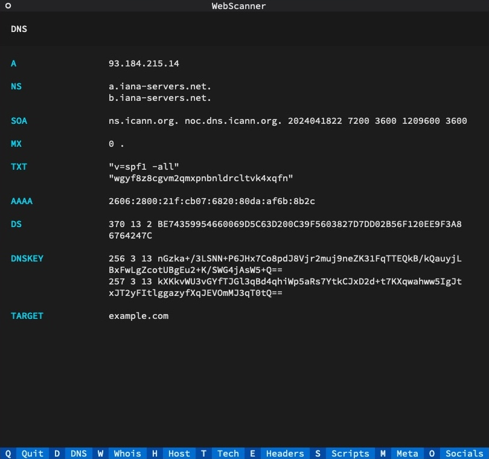
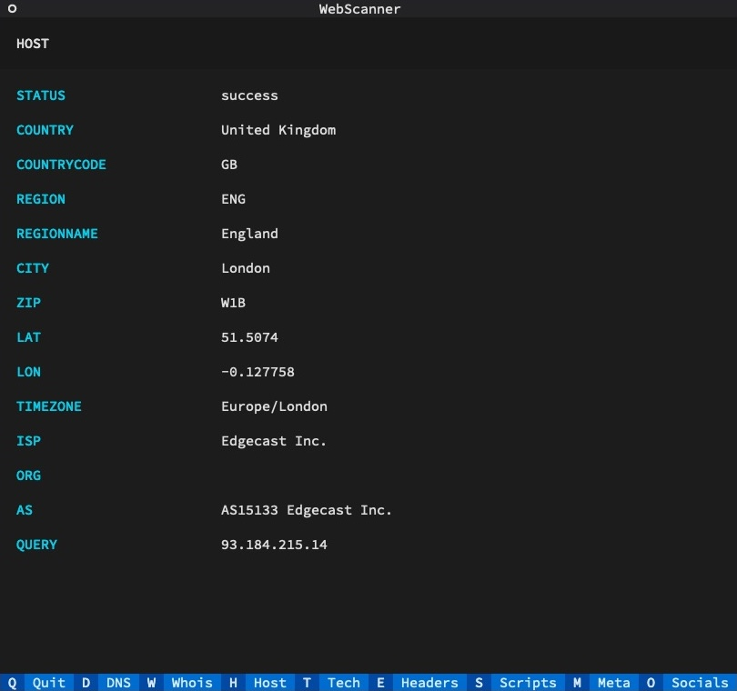

# WebScanner

WebScanner is a Python TUI (Text-based User Interface) application that provides comprehensive information about a website. It utilises various techniques to gather data, including DNS lookups, WHOIS scans, server host lookups, and more – all in one place, and without the need for external APIs.

## Features

- **DNS Lookup:** Perform a dig lookup for all DNS records, including AAAA, MX, etc.
- **WHOIS Scan:** Retrieve WHOIS information for the website.
- **Server Host Lookup:** Show IP address, location, and host provider information.
- **Tech Stack Identification:** Identify the technology stack used on the website, including languages, libraries, web servers, CMS, etc.
- **Header Grabbing:** Get the headers for the site.
- **Script URLs Listing:** List all the URLs of scripts used on the website.
- **Meta Information:** Show meta information such as title, description, and all headings on the page.
- **Social Media Links:** List all the social media links found on the page.

## Installation

1. Clone the repository:

   ```bash
   git clone https://github.com/iamramizk/web-scanner.git
   ```

2. Create a new virtual environment and activate it:

   ```bash
   python3 -m venv .venv
   source .venv/bin/activate   # for Unix/macOS
   .venv\Scripts\activate      # for Windows
   ```

3. Install dependencies:

   ```bash
   pip install -r requirements.txt
   ```

## Usage
Run the application:

   ```bash
   python3 app.py example.com
   ```

## Screenshots



